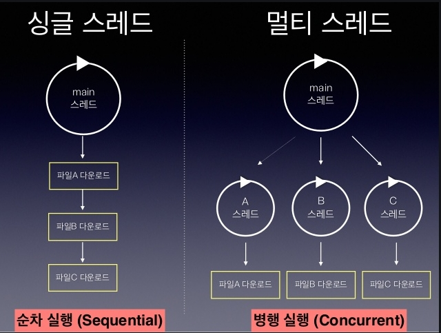
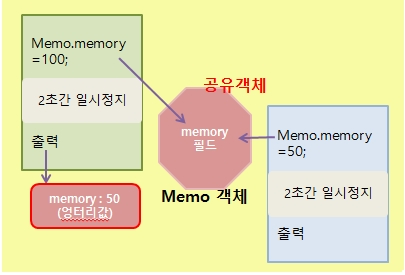

multiThread
===========
## multiThread
* 스레드(Thread)
사전적 의미로 '한 가닥의 실' 
한 가지 작업을 실행하기 위해 순차적으로 실행할 코드를 실처럼 이어 놓았다고 해서 유래된 이름이다.
즉 하나의 스레드는 하나의 코드 실행 흐름 

* 프로세스(process)
운영체제에서 실행 중인 하나의 애플리케이션  
사용자가 애플리케이션을 실행하면 운영체제로부터 실행에 필요한 메모리를 할당받아 애플리케이션의 코드를
실행하는데 이것이 프로세스이다.  
 - 멀티 태스킹(multi tasking)
   두 가지 이상의 작업을 동시에 처리하는 것  
   운영체제는 멀티 태스킹을 할 수 있도록 CPU 및 메모리 자원을 프로세스마다 적절히 할당해주고, 병렬로 실행
 - chrome 브라우저 두 개 실행하면 두 개의 프로세스가 실행 된것이다. 작업 관리자 --> 프로세스에서 확인 가능

 * 프로세스와 스레드 차이점
  - 멀티 프로세스 :
운영체제에서 할당받은 자신의 메모리를 가지고 실행하기 때문에 서로 독립적이다.
 하나의 프로세스에서 오류가 발생해도 다른 프로세스에게 영향을 미치지 않는다.
  - 멀티 스레드 :
  하나의 프로세스 내부에 생성되기 때문에 하나의 스레드가 예외를 발생시키면 프로세스 자체가 종료될 수 있다.
  다른 스레드에게 영향을 미치게 된다.
  - example :
  멀티 프로세스인 워드와 엑셀을 동시에 사용하던 도중, 워드에 오류가 생겨 먹통이 되더라고 엑셀은 여전히 사용 가능하다.  
  멀티 스레드로 동작하는 메신저의 경우 파일을 전송하는 스레드에서 예외가 발생되면 메신저 프로세스 자체가 종료되기 때문에 채팅 스레드도 같이 종료 된다.   그래서 **멀티 스레드에서는 예외 처리에 만전을 기해야 한다**

#### Runnable
###### 작업 스레드가 실행할 수 있는 코드를 가지고 있는 객체
인터페이스이기 때문에 구현 객체를 만들어서 대입해야 한다.
<pre><code>
 class Task implements Runnable{
   public void run(){
      code .....
   }
 }
 </code>
</pre>

Runnable은 작업 내용을 가지고 있는 객체이지 실제 스레드는 아니다.
보통 Thread 생성자를 호출할 때 Runnable 익명 객체를 매개값으로 사용 할 수 있다.
<pre><code>
Thread thread = new Thread(new Runnable(){
  public void run(){
      스레드가 실행할 코드
     }
  })
</code></pre>

작업 스레드는 생성되는 즉시 실행되는 것이 아니고, start() 메소드를 호출해야 실행된다.
<pre><code>
thread.start();
</code></pre>

### 동기화 블록
#### 멀티스레드 사용시 스레드들이 객체를 공유해서 작업할 경우 주의점
객체를 공유해서 작업할 경우 스레드A가 사용하던 객체를 스레드B에 의해 상태가 변경될 수 있다.
 
그래서 스레드가 사용중인 객체를 다른 스레드가 변경할 수 없도록 해야한다.
어떻게? 잠금을 걸어서 다른 스레드가 사용할 수 없도록 해야 한다.

#### 동기화(Synchronized)
임계영역(critical section) : 멀티 스레드 프로그램에서 단 하나의 스레드만 실행할 수 있는 코드 영역
자바는 동기화(Synchronized)로 임계영역을 지정한다. 동기화를 하면 객체에 잠금을 걸어 다른 스레드가 임계 영역 코드를 실행하지 못하도록 한다. 
메소드 전체 또는 블록을 만들어서 일부분만 지정할 수도 있다.

### 스레드 상태 제어
#### 스레드를 일시정지 또는 종료 시키는 것들을 상태 제어라고 한다
메소드 종류  
|메소드|설명|
|------------|:-------|
|interrupt()|일시 정지 상태의 스레드에서 InterruptedException 예외를 발생시켜, 예외처리 코드(catch)에서 실행 대기 상태로 가거나 종료 상태로 갈 수 있도록 한다.|
|notify() notifyAll()|동기화 블록 내에서 wait()메소드에 의해 일시 정지 상태에 있는 스레드를 실행 대기 상태로 만든다.|
|resume()|suspent() 메소드에 의해 일시 정지 상태에 있느느 스레드를 실행 대기 상태로 만든다. -Deprecated (대신 notify(), notifyAll() 사용)|
|sleep(long millis) sleep(long millis, int nanos)|주어진 시간 동안 스레드를 일시 정지 상태로 만든다. 주어진 시간이 지나면 자동적으로 실행 대기 상태가 된다.|
|join() join(long millis) join(long millis,int nanos)|join() 메소드를 호출한 스레드는 일시 정지 상태가 된다. 실행 대기 상태로 가려면, join() 메소드를 멤버로 가지는 스레드가 종료되거나, 매개값으로 주어진 시간이 지나야 한다.|
|wait() wait(long millis) wait(long mills,int nanos)|동기화(synchronized) 블록 내에서 스레드를 일시 정지 상태로 만든다. 매개값으로 주어진 시간이 지나면 지동적으로 실행 대기 상태가 된다. 시간이 주어지지 않으면 notify(), notifyAll() 메소드에 의해 실행 대기 상태로 갈 수 있다.|
|suspend()|스레드를 일시 정지 상태로 만든다. resume()메소드를 호출하면 다시 실행대기 상태가 된다. -Deprecated(대신 wait() 사용)|
|yield()|실행 중에 우선순위가 동일한 다른 스레드에게 실행을 양보하고 실행 대기 상태가 된다.|
|stop()|스레드를 즉시 종료시킨다. -Deprecated|
 

**wait,notify,notifyAll 은 Object 클래스 메소드 그 외는 모두 Thread 클래스듸 메소드**

